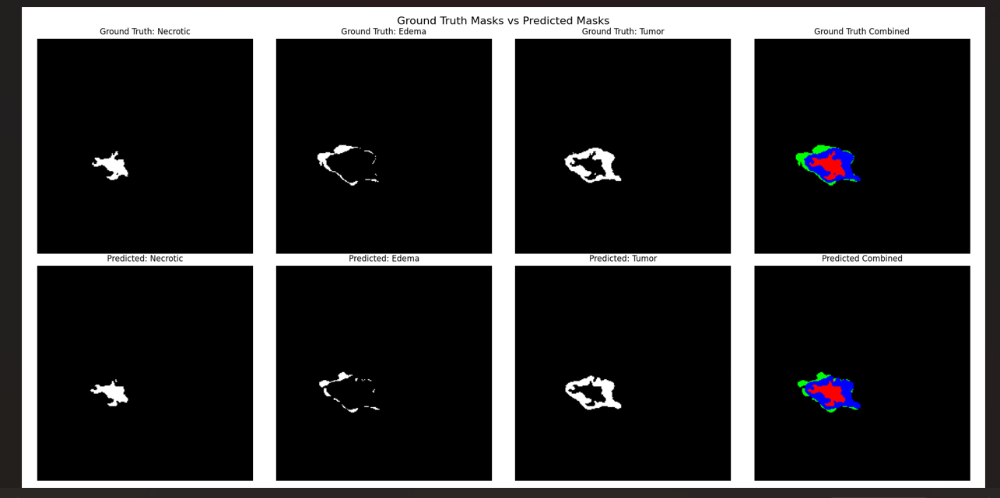
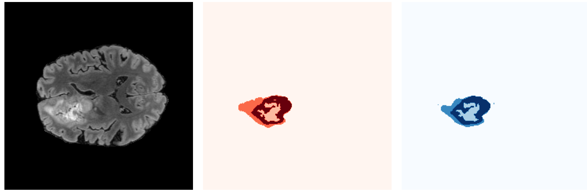
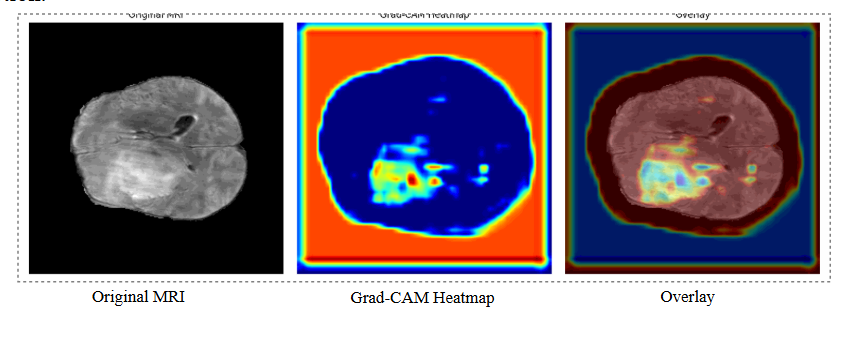

🧠 Brain Tumor Segmentation using BesNet U-Net
📌 Problem Statement

Brain tumors are among the most critical and life-threatening neurological disorders. Accurate identification and segmentation of tumor regions from MRI scans is essential for diagnosis, treatment planning, and monitoring disease progression.

However, manual tumor segmentation by radiologists:

Is time-consuming

Is prone to human variability

Becomes difficult due to irregular tumor shapes and low contrast boundaries

This creates a strong need for automated, accurate, and reliable segmentation systems using deep learning.

❓ Why Brain Tumor Segmentation is Challenging

Brain tumor segmentation is not a simple image processing task because:

Tumors have complex and irregular boundaries

Different tumor sub-regions exist:

Necrotic core

Edema

Enhancing tumor

MRI images vary across modalities (FLAIR, T1, T1ce, T2)

Strong class imbalance exists between tumor and background

Deep learning models often act as black boxes, which reduces clinical trust

🎯 Objective of This Project

The goal of this project is to build an automated brain tumor segmentation system that:

Accurately segments tumor regions from MRI scans

Handles complex tumor structures using deep learning

Improves feature learning using BesNet residual blocks

Provides explainability using Grad-CAM to understand model decisions

🧠 What is Being Implemented

This repository contains my individual implementation of:

U-Net enhanced with BesNet residual blocks
for brain tumor segmentation using multimodal MRI data.

The project is part of a larger comparative study (discussed in the report), but this repository focuses only on the BesNet U-Net model implemented by me.

🏗️ Model Overview: BesNet U-Net

Base architecture: U-Net

Enhancement: BesNet residual blocks

Purpose of BesNet blocks:

Improve gradient flow

Preserve spatial features

Enhance segmentation of small and irregular tumor regions

The model performs multi-class segmentation of:

Background

Necrotic tumor core

Edema

Enhancing tumor

📊 Dataset Used

BraTS (Brain Tumor Segmentation) Dataset

Multimodal MRI scans:

FLAIR

T1

T1ce

T2

📌 Note:
The dataset is not included in this repository due to size and licensing constraints.

⚙️ Data Preprocessing

The following preprocessing steps are applied:

Conversion of NIfTI volumes to NumPy arrays

Slice selection focusing on tumor-positive regions

Image resizing to 128 × 128

Min-Max normalization

Mask alignment using nearest-neighbor interpolation

These steps ensure consistent input for the deep learning model.

🚀 Training Strategy

Loss function: Dice Loss (handles class imbalance)

Optimizer: Adam / SGD (tested experimentally)

Data augmentation:

Rotation

Flipping

Multi-class softmax output

🖼️ Qualitative Results: Segmentation Outputs

The following images show ground truth vs predicted segmentation masks, demonstrating the model’s ability to accurately localize tumor regions and sub-regions.

🔹 Ground Truth vs Predicted Segmentation

🔹 Predicted Tumor Mask Overlay

These results show strong spatial alignment between predicted masks and ground truth annotations.

🔍 Explainable AI: Grad-CAM Visualization

Deep learning models are often criticized for being black boxes.
To address this, Grad-CAM (Gradient-weighted Class Activation Mapping) is used to explain model predictions.

Grad-CAM highlights which regions of the MRI image influenced the model’s decision, increasing trust and interpretability.

🔹 Grad-CAM Heatmap & Overlay

🔹 Grad-CAM Animation (Slice-wise Attention)

📌 These visualizations confirm that the model focuses on clinically relevant tumor regions, not background noise.

📈 Performance Summary (Textual)

The BesNet U-Net model achieves:

Strong Dice score for tumor segmentation

Good precision and recall balance

Improved boundary alignment compared to baseline U-Net

(Detailed numerical comparisons and architecture diagrams are available in the project report and results folders.)

📁 Repository Structure
Brain_Tumor_Segmentation_BesNet_UNet/
│
├── model.py
├── train.py
├── dataset.py
├── utils.py
├── main.py
├── requirements.txt
├── outputs/
│
└── results/
    ├── segmentation_output/
    ├── gradcam/
    ├── metrics/
    └── Architecture/

🎯 Key Learnings from This Project

Practical experience with medical image segmentation

Working with multimodal MRI data

Designing and training deep learning segmentation models

Handling class imbalance using Dice loss

Applying Explainable AI (Grad-CAM) for model interpretability

Structuring a clean, professional ML GitHub repository

✅ Conclusion

This project demonstrates that BesNet-enhanced U-Net is an effective architecture for brain tumor segmentation.
The model successfully learns complex tumor structures and produces accurate segmentation masks while maintaining interpretability through Grad-CAM.

The combination of deep learning + explainable AI makes this approach suitable for real-world medical imaging applications.

🔮 Future Scope

Extend from 2D slices to full 3D volumetric segmentation

Integrate Transformer-based architectures

Improve segmentation of very small tumor regions

Deploy as a clinical decision support tool

Add uncertainty estimation for medical reliability

👤 Author

Prahalya S P
B.Tech – Computer Science
Focus Areas: Deep Learning, Medical Image Analysis, Explainable AI